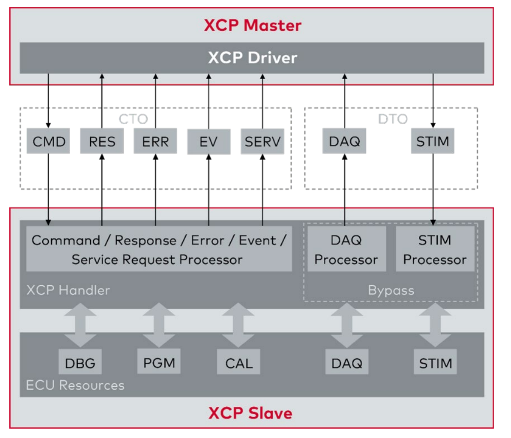

# XCP-Kommunikationsmodell 

Das XCP (Universal Measurement and Calibration Protocol) Kommunikationsmodell ermöglicht den frame- oder paketbasierten Datenaustausch zwischen einem Master und einem Slave in Automobilanwendungen. Dieses Tutorial bietet eine umfassende Erklärung des XCP-Kommunikationsmodells und behandelt sowohl die Command Transfer Objects (CTO) als auch die Data Transfer Objects (DTO), wie sie im bereitgestellten Diagramm dargestellt sind.

## 1. Überblick über das XCP-Kommunikationsmodell

XCP ermöglicht einen effizienten Datenaustausch zwischen einem XCP-Master (typischerweise eine Steuereinheit oder ein Testgerät) und einem XCP-Slave (ein Steuergerät oder ECU). Das Kommunikationsmodell unterscheidet zwischen dem Austausch von Kommandos (CTO) und der Übertragung synchroner Daten (DTO).

### 1.1 Komponenten und Datenfluss

Das XCP-Kommunikationsmodell umfasst die folgenden Hauptkomponenten:

- **XCP Master**: Initiiert die Kommunikation und sendet Kommandos.
- **XCP Driver**: Verwaltert die Kommunikation zwischen Master und Slave.
- **XCP Slave**: Führt Kommandos aus und antwortet dem Master.
- **ECU Ressourcen**: Umfassen Debugging, Programmierung, Kalibrierung, Datenakquisition und Stimulation.

### 1.2 Abkürzungen und deren Funktionen

Die im XCP-Kommunikationsmodell verwendeten Abkürzungen sind entscheidend für das Verständnis des Datenflusses und der Art der ausgetauschten Pakete:

- **CMD (Command Packet)**: Dient zum Senden von Kommandos vom Master an den Slave.
- **RES (Command Response Packet)**: Positive Antwort auf ein CMD.
- **ERR (Error Packet)**: Negative Antwort, die einen Fehler anzeigt.
- **EV (Event Packet)**: Stellt ein asynchrones Ereignis dar.
- **SERV (Service Request Packet)**: Wird für Serviceanfragen verwendet.
- **DAQ (Data Acquisition Packet)**: Sendet zyklische Messdaten.
- **STIM (Stimulation Packet)**: Zyklische Stimulation des Slaves.
- **DBG (Debugging)**: Debugging über den XCP-Slave.
- **PGM (Programming)**: Flashen neuer Programme oder Daten in das Steuergerät.
- **CAL (Calibration/Paging)**: Ändern von Parametern oder Umschalten der Kalibrierungsseiten.

## 2. Command Transfer Objects (CTO)

CTOs werden für den Austausch von Kommandos und den Empfang von Antworten zwischen dem Master und dem Slave verwendet. Diese Interaktion umfasst:

- **Command Packet (CMD)**: Der Master sendet ein Kommando an den Slave.
- **Command Response Packet (RES)**: Der Slave antwortet positiv auf das CMD.
- **Error Packet (ERR)**: Der Slave zeigt einen Fehler als Antwort auf das CMD an.
- **Event Packet (EV)**: Der Slave sendet asynchrone Ereignisse an den Master.
- **Service Request Packet (SERV)**: Der Master fordert Dienste vom Slave an.

Der Kommandoaustausch stellt sicher, dass der Master den Slave effektiv steuern und Daten abrufen kann. Typischerweise muss ein CMD immer vom Slave mit entweder RES oder ERR Paketen beantwortet werden.

## 3. Data Transfer Objects (DTO)

DTOs behandeln die synchrone Übertragung von Daten zwischen dem Master und dem Slave. Dies umfasst:

- **Data Acquisition Packet (DAQ)**: Der Slave sendet zyklische Messdaten an den Master.
- **Stimulation Packet (STIM)**: Der Master sendet zyklische Stimulationsdaten an den Slave.

DTOs sind wesentlich für den Echtzeitdatenaustausch und gewährleisten, dass der Master kontinuierliche Messdatenströme empfangen oder periodische Stimuli an den Slave senden kann.

## 4. Detaillierte Erklärung der ECU-Ressourcen

Die vom XCP-Slave verwalteten ECU-Ressourcen sind entscheidend für verschiedene Aufgaben:

- **Debugging (DBG)**: Ermöglicht Echtzeit-Debugging des ECUs über XCP.
- **Programming (PGM)**: Umfasst das Flashen neuer Programme oder das Aktualisieren von Daten im ECU.
- **Calibration (CAL)**: Ermöglicht das Ändern von Parametern und das Umschalten von Kalibrierungsseiten.
- **Data Acquisition (DAQ)**: Verwaltert das zyklische Senden von Messdaten.
- **Stimulation (STIM)**: Steuert die zyklische Stimulation des Slaves für Testzwecke.

## 5. Austausch von Status Informationen zwischen XCP Master und Slave

## 6. Standard Communication Mode

## 7. Master Block Transfer Mode

## 8. Slave Block Transfer Mode

## 9. Interleaved Communication Mode

 